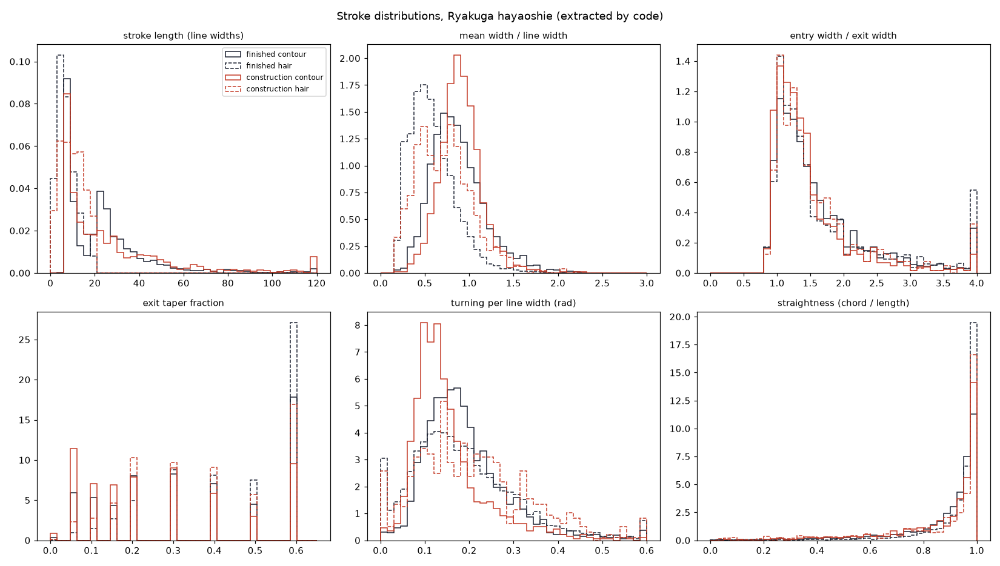

# Stroke laws of the Ryakuga hayaoshie

Measured by `extract/analyze.py` from strokes that `extract/run.py` traced out of the scans. No stroke was placed by hand.

- Regions analysed: **99** (50 finished, 35 construction, 14 written)
- Lengths and widths are in **line widths**: multiples of each region's median line width.
- *End asymmetry*: 0 = both ends the same width, 1 = one end comes to a point. *Middle swell*: middle width ÷ mean end width.
- *Sharp / blunt tip*: how far the ink runs past the skeleton end, in half-widths, at the sharper and the blunter end. About 1 = a pressed, blunt end; well above 1 = a tapered, lifted tip.

## Finished drawings

| category | strokes | length p25 / p50 / p75 | mean width | end asymmetry | middle swell | sharp tip | blunt tip | straightness |
|---|---|---|---|---|---|---|---|---|
| contour | 2143 | 8.5 / 21.1 / 29.9 | 0.83 | 0.29 | 1.46 | 2.8 | 1.5 | 0.94 |
| hair | 9251 | 4.1 / 6.7 / 10.0 | 0.55 | 0.27 | 2.13 | 3.0 | 1.6 | 0.97 |
| tick | 5801 | 2.4 / 3.3 / 4.4 | 0.49 | 0.36 | 2.79 | 2.5 | 1.5 | 0.99 |
| dot | 600 | 1.4 / 1.6 / 1.8 | 0.53 | 0.15 | 3.79 | 1.5 | 1.2 | 0.99 |
| whorl | 64 | 19.1 / 28.8 / 48.8 | 0.87 | 0.27 | 1.26 | 2.7 | 1.5 | 0.26 |
| compass | 67 | 13.0 / 14.2 / 16.5 | 0.81 | 0.25 | 1.32 | 2.2 | 1.5 | 0.85 |
| ruled | 112 | 37.7 / 54.3 / 77.9 | 0.81 | 0.22 | 1.06 | 2.1 | 1.4 | 1.00 |

## Construction drawings

| category | strokes | length p25 / p50 / p75 | mean width | end asymmetry | middle swell | sharp tip | blunt tip | straightness |
|---|---|---|---|---|---|---|---|---|
| contour | 1301 | 8.9 / 18.3 / 35.1 | 0.89 | 0.23 | 1.31 | 2.5 | 1.5 | 0.95 |
| hair | 646 | 5.3 / 9.6 / 14.0 | 0.70 | 0.27 | 1.73 | 2.7 | 1.5 | 0.96 |
| tick | 1124 | 2.2 / 3.3 / 4.5 | 0.48 | 0.34 | 2.62 | 2.5 | 1.5 | 0.99 |
| dot | 75 | 1.4 / 1.6 / 2.0 | 0.58 | 0.15 | 3.83 | 1.4 | 1.2 | 0.99 |
| whorl | 62 | 33.9 / 68.2 / 96.8 | 0.99 | 0.11 | 1.04 | 2.5 | 1.6 | 0.17 |
| compass | 106 | 16.3 / 21.3 / 28.4 | 0.87 | 0.18 | 1.22 | 2.5 | 1.5 | 0.77 |
| ruled | 86 | 33.0 / 43.6 / 53.6 | 0.91 | 0.14 | 1.06 | 2.2 | 1.5 | 0.99 |

## Joins

Share of stroke ends that stop short of other ink (an open joint):

- finished contour: **34%** open (4286 ends)
- finished hair: **19%** open (18502 ends)
- finished compass: **33%** open (134 ends)
- construction contour: **38%** open (2602 ends)
- construction hair: **28%** open (1292 ends)
- construction compass: **41%** open (212 ends)

## Hair against the form

Angle between a hair stroke and the outline tangent nearest its root (0° = lies along the edge, 90° = grows straight out of it):

- finished: median **40°** (9251 hairs); histogram by 10°: [1552, 1263, 977, 871, 822, 844, 881, 933, 1108]; median length near the edge 7.02 vs far from it 6.03 line widths; corr(distance, length) = -0.086
- construction: median **47°** (646 hairs); histogram by 10°: [82, 66, 66, 63, 69, 57, 60, 90, 93]; median length near the edge 9.28 vs far from it 9.91 line widths; corr(distance, length) = -0.053
- written: median **45°** (288 hairs); histogram by 10°: [39, 27, 25, 31, 40, 32, 28, 32, 34]; median length near the edge 7.97 vs far from it 7.36 line widths; corr(distance, length) = -0.021

## Width against length

Fitted exponent b in width ∝ length^b (0 = width independent of length):

- finished: contour b=0.23 (n=2143), hair b=0.37 (n=9251), whorl b=0.19 (n=64), tick b=0.61 (n=5801), dot b=0.89 (n=600), compass b=0.29 (n=67), ruled b=0.19 (n=112)
- construction: contour b=0.13 (n=1301), whorl b=0.04 (n=62), hair b=0.49 (n=646), tick b=0.64 (n=1124), compass b=0.01 (n=106), ruled b=0.10 (n=86), dot b=1.10 (n=75)
- written: contour b=0.36 (n=205), tick b=0.55 (n=409), hair b=0.45 (n=288)

## Parameters for the engine

Written to `data/hand-params.json` and loaded by the engine:

```json
{
 "source": "extract/analyze.py over 99 regions",
 "line_width_rel": 0.008,
 "contour": {
  "len_w": [
   8.53,
   21.128,
   29.867
  ],
  "ts": [
   0.1,
   0.15,
   0.3
  ],
  "te": [
   0.15,
   0.3,
   0.6
  ],
  "swell_frac": 0.232,
  "end_asym": 0.286,
  "mid_swell": 1.463,
  "tip_sharp": 2.75,
  "tip_blunt": 1.5,
  "w_cv": 0.372,
  "wmax_rel": 1.338,
  "open_end_frac": 0.342
 },
 "hair": {
  "len_w": [
   4.079,
   6.65,
   9.988
  ],
  "w_rel": 0.546,
  "te": 0.5,
  "ts": 0.3,
  "in_out": 1.368,
  "end_asym": 0.268,
  "tip_sharp": 2.99,
  "tip_blunt": 1.58,
  "open_end_frac": 0.19
 },
 "tick": {
  "len_w": 3.325,
  "in_out": 1.571,
  "w_rel": 0.489
 }
}
```


